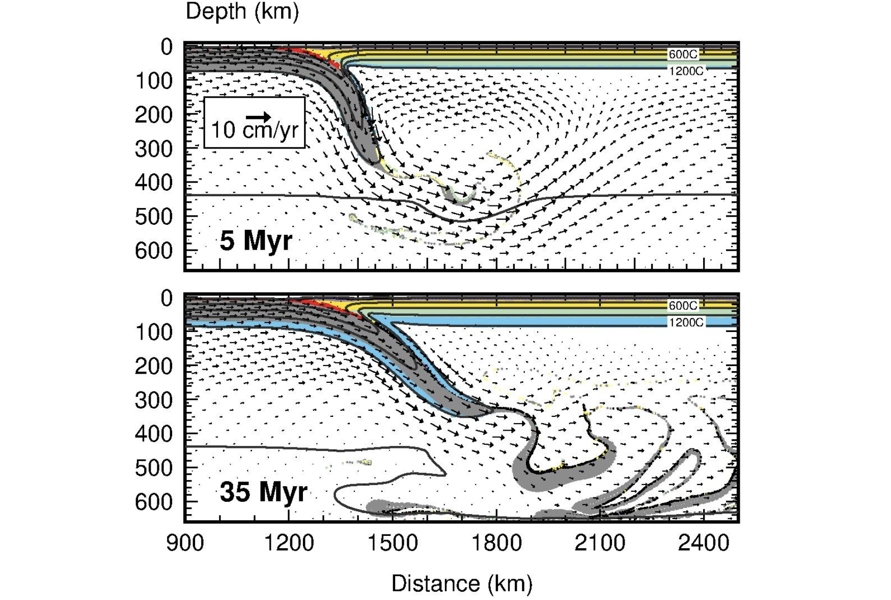
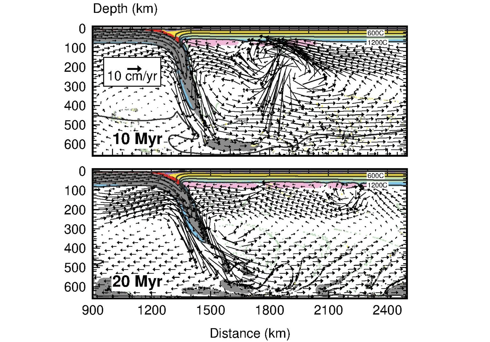

# 🌍 SOPALE Mantle Convection and Subduction Modeling


# 📖 Overview

This repository presents a professional computational geodynamics portfolio project based on thermo-mechanical numerical modeling using the SOPALE geodynamic framework.

The models investigate:

- Mantle convection
- Subduction dynamics
- Lithosphere-mantle interaction
- Small-scale convection (SSC)
- Edge-driven convection (EDC)
- Thermal evolution of continental lithosphere

The repository is designed as a portfolio-level scientific showcase of an ongoing research project while protecting unpublished manuscript details and confidential simulation inputs.

---

# 🎯 Scientific Objectives

The primary goals of this project are to:

- Investigate mechanisms maintaining thin Cordillera lithosphere
- Analyze mantle wedge flow and subduction-driven corner flow
- Examine development of small-scale convection (SSC)
- Explore edge-driven convection (EDC) near the Cordillera-Craton boundary
- Study thermo-mechanical evolution of lithosphere over geological timescales
- Understand the role of mantle rheology in lithosphere evolution

---

# 🧠 Physical Processes Investigated

| Process | Description |
|---|---|
| 🔄 Corner Flow | Subduction-driven mantle wedge circulation |
| 🌊 Small-Scale Convection (SSC) | Localized convective instabilities beneath lithosphere |
| 🌀 Edge-Driven Convection (EDC) | Mantle circulation caused by lithosphere thickness contrasts |
| 🌡 Thermal Evolution | Long-term lithosphere heating and thinning |
| 🪨 Mantle Rheology | Influence of wet, damp, and dry mantle viscosity structures |

---

# 🛠 Technical Skills Demonstrated

## Computational Geodynamics
- Thermo-mechanical mantle convection modeling
- Lithosphere-scale numerical simulations
- Mantle rheology analysis
- Subduction zone dynamics

## Scientific Computing
- Fortran-based geodynamic modeling
- HPC-oriented simulation workflows
- Numerical analysis and interpretation
- Scientific post-processing

## Visualization & Interpretation
- Mantle flow visualization
- Vector field interpretation
- Thermal structure analysis
- Geodynamic figure preparation

---

# ⚙️ Numerical Modeling Framework

## Modeling Software
- SOPALE geodynamic framework

## Model Features
- 2D thermo-mechanical simulations
- Ocean-continent-craton configurations
- Variable mantle rheology
- Subduction-driven mantle circulation
- Temperature-dependent lithosphere evolution

## Research Themes
- Cascadia subduction system
- Western Canada lithosphere evolution
- Mantle-lithosphere interaction
- Backarc mantle dynamics

---

# 📂 Repository Structure

```text
SOPALE-mantle-convection-modeling/
│
├── README.md
│
├── docs/
│   └── project_summary.md
│
├── figures/
│   ├── representative_subduction_simulation1.png
│   ├── wet_mantle_simple_subduction_corner_flow_ssc.png
│   └── wet_mantle_subduction_with_craton_CF_SSC_EDC.png
```

---

# 📊 Representative Simulation Results

## 🌋 Thermo-Mechanical Subduction Simulation

The figure below illustrates representative mantle flow patterns, slab evolution, and lithosphere-mantle interaction over geological timescales.

<p align="center">
  
</p>

---

# 🌊 Small-Scale Convection (SSC) and Corner Flow

This simulation demonstrates the interaction between:

- Subduction-driven corner flow
- Mantle wedge circulation
- Small-scale convection (SSC)
- Lithosphere thermal evolution

## Key Scientific Observations

- Corner flow transports hot asthenosphere beneath the overriding plate
- Hydrated mantle rheology promotes SSC development
- SSC contributes to lithosphere thinning
- Mantle circulation dynamically modifies thermal structure

<p align="center">
  
</p>

---

# 🌀 SSC, Corner Flow, and Edge-Driven Convection (EDC)

This model includes lithospheric thickness contrasts between Cordillera and cratonic lithosphere to investigate coupled mantle flow dynamics.

## Processes Investigated

- Corner flow
- Small-scale convection (SSC)
- Edge-driven convection (EDC)
- Mantle-lithosphere interaction
- Thermal and rheological evolution

## Key Scientific Observations

- EDC develops near lithosphere thickness gradients
- SSC and corner flow dominate lithosphere thinning
- Mantle rheology strongly influences convection structure
- Complex coupled mantle circulation emerges beneath continental lithosphere

<p align="center">
  
</p>

---

# 🧪 Scientific Interpretation

The simulations suggest that:

- Corner flow alone is insufficient to maintain thin lithosphere
- Hydrated mantle rheology is necessary for sustained SSC development
- SSC plays a dominant role in preserving thin Cordillera lithosphere
- EDC provides secondary but regionally important mantle circulation
- Subduction-driven mantle flow strongly controls lithosphere evolution

---

# 🚀 Future Work

Future project expansion includes:

- 3D thermo-mechanical ASPECT modeling
- Toroidal mantle flow investigations
- Slab-edge and slab-gap dynamics
- Craton-lithosphere interaction studies
- Time-dependent lithosphere evolution
- Advanced mantle rheology parameterization

---

# 💻 Computational Workflow

The modeling workflow includes:

- Geodynamic model development
- HPC-oriented numerical simulations
- Mantle rheology experiments
- Scientific visualization
- Numerical interpretation
- Geological process analysis

---

# 🔒 Confidentiality Note

This repository provides a portfolio-level summary of an ongoing manuscript-related geodynamic modeling project.

To protect unpublished research material:

- Full model inputs are not included
- Raw HPC simulation outputs are excluded
- Manuscript-specific parameterizations are omitted
- Proprietary research interpretations are not fully disclosed

The repository is intended to demonstrate technical and scientific capabilities in:

- Computational geodynamics
- Scientific computing
- Numerical modeling
- HPC workflows
- Geophysical interpretation

---

# Author

**Amar Jyoti Baruah**  

Research Areas:
- Computational Geodynamics
- Mantle Convection
- Lithosphere Evolution
- Numerical Modeling
- Scientific Computing

---
