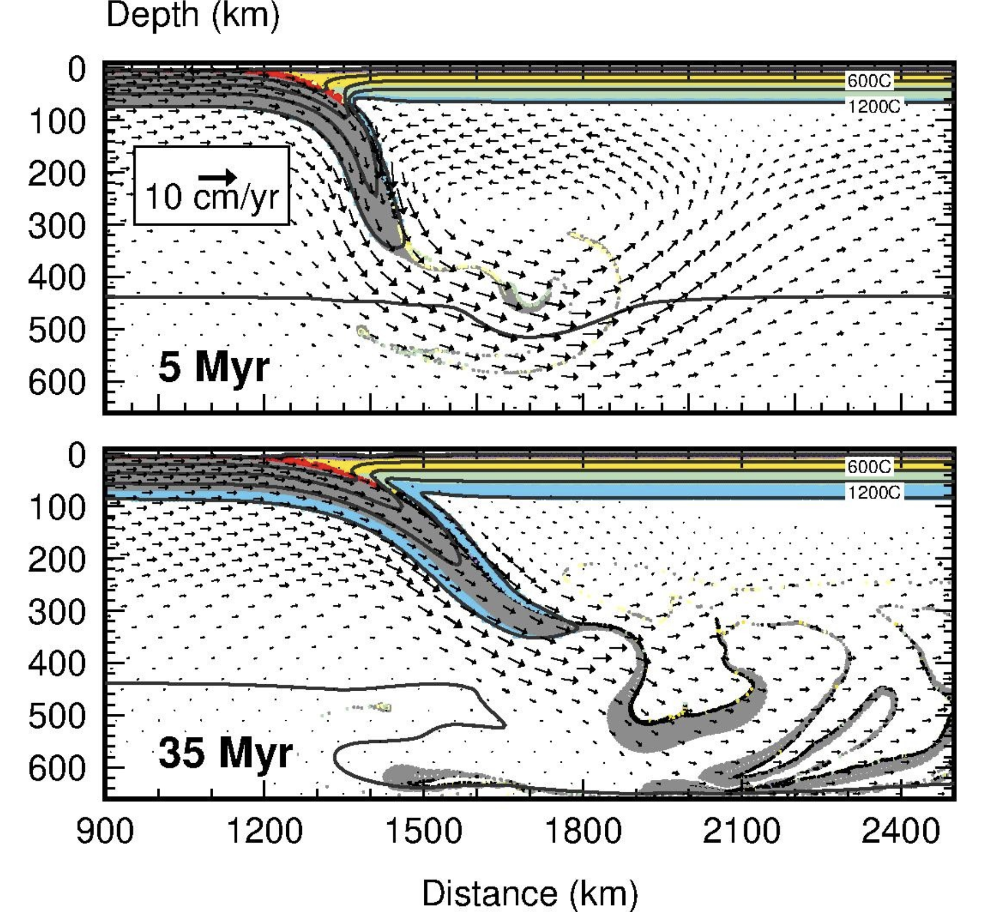

# SOPALE Mantle Convection and Subduction Modeling

## Overview

This repository presents a 2D thermo-mechanical numerical modeling project using SOPALE, a Fortran-based geodynamic modeling framework.

The project investigates mantle convection, subduction dynamics, and lithosphere-mantle interactions in a simplified tectonic setting. The repository is designed as a professional portfolio version of a manuscript-related research project, highlighting computational modeling, post-processing, visualization, and scientific interpretation skills without exposing unpublished model details.

## Technical Skills Demonstrated

- Numerical geodynamic modeling
- Thermo-mechanical mantle convection simulation
- Fortran-based scientific computing
- Computational geoscience workflows
- Scientific visualization and interpretation
- Research-oriented numerical analysis
- Workflow organization for HPC-style simulations

## Repository Structure

```text
SOPALE-mantle-covection-code/
│
├── README.md
├── docs/
│   └── project_summary.md
│
├── figures/
│   └── workflow.png
```
## Representative Simulation Result

The figure below shows representative thermo-mechanical subduction simulations illustrating mantle flow patterns, slab evolution, and lithosphere-mantle interaction over geological timescales.



## Confidentiality Note

This repository provides a portfolio-level summary of a manuscript-related research project. Full model inputs, unpublished parameter files, raw simulation outputs, and manuscript-specific results are not included.

The goal of this repository is to demonstrate technical capability in numerical modeling, scientific computing, and geodynamic interpretation while protecting unpublished research details.
